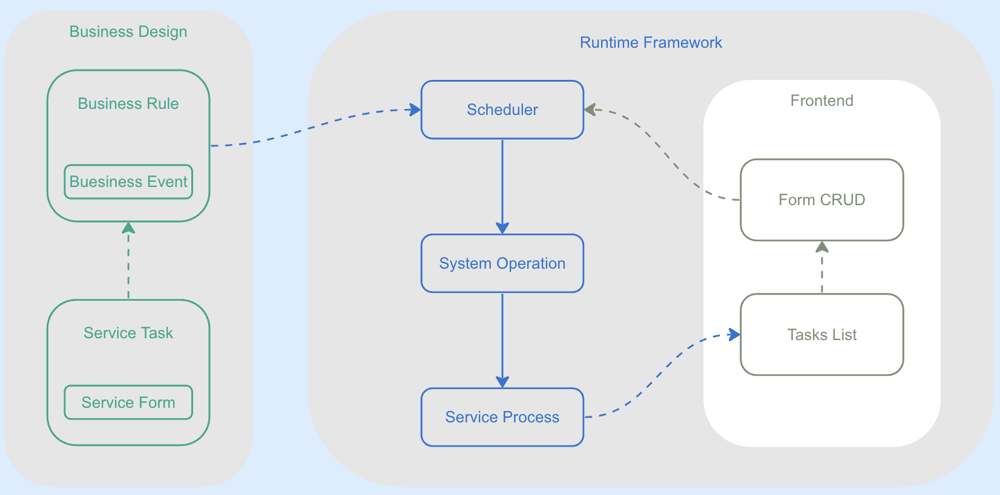
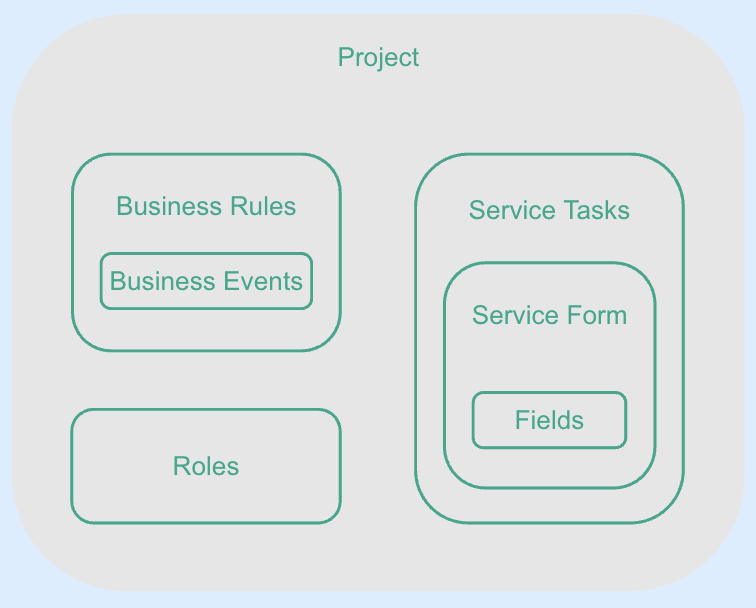

## Service Design Subsystem | [中文文档](./docs/README_zh.md)

### 🚀 Features 
#### This project is the service design subsystem of a system for customizing healthcare application.
* The goal of the healthcare application is to coordinate and push the correct information to the right people at the right time.

* The fundamental solution to this problem is to generate a suitable next task for each collaborator involved, where "suitable" means in accordance with the predetermined business rules.

* In order to meet the unique needs of the healthcare industry, service tasks and business rules need to be customized by business designers. The system can immediately generate business applications for publication and operation based on the customized business design.

* The application customized by the business designer can collaborate with multiple healthcare experts' service tasks according to the preset business rules to complete user service tasks.

* The HSSC runtime framework subsystem imports the business system script generated by the design subsystem. After migration, it can be lunched, and the entire process can be completed in 10 minutes.

* Service tasks will be pushed to each healthcare expert's tasks list on workbench at the right time according to the business rules defined by the business manager to achieve efficient team collaboration.

* Reference runtime framework subsystem: https://github.com/jinniudashu/hssc

### 🧠 Core concepts
#### The core business model consists of seven key elements, which is a general collaboration system abstraction.
1. Service tasks: defined by service task metadata, management attribute, and business attribute.

2. Service form: the work product of the service task, represented by a JSON form consisting of key-value pairs of multiple business fields.

3. Business event: when the value of a business field in the service form meets certain conditions which is expressed as a logic expression, a certain business event is considered occurring.

4. Service rules: after completing the service task, what action (system job) should be taken if a certain business event occurs.

5. System job: system scheduling actions, currently including generating the next task, recommending the next task, sending WeChat public account messages, and sending Enterprise WeChat messages. Additional system jobs can be added based on user needs.

6. Service process: used to manage and schedule service task status during service task runtime.

7. Scheduler: determines which system scheduling action should be taken based on the business rules when the service process status changes.



### 👨‍🚀 Getting Started
#### 📋 Requirements
* .env file is required at the root directory of the project, please refer to .env.example for the required environment variables.

* If there are computed fields in the designing, OPENAI_API_KEY is required to generating JS code.

#### 🛠️ Manual Installation
1. Clone the code repository to your local machine:
```bash
    git clone https://github.com/your_username/formdesign.git
```
2. Navigate to the project directory:
```bash
    cd formdesign
```
3. Create a virtual environment:
```bash
    python -m venv env
    source env/bin/activate  # Linux or macOS
    .\env\Scripts\activate  # Windows
```
4. Install the dependencies:
```bash
    pip install -r requirements.txt
```
5. Perform database migration:
```bash
    python manage.py migrate
```
6. Create a superuser account:
```bash
    python manage.py createsuperuser
```
8. Load the dictionary and design data:
```bash
    python manage.py restore_icpc
    python manage.py restore_design
```
9. Run the development server on port 8001 if you are running the HSSC application on port 8000:
```bash
    python manage.py runserver 8001
```
10. Open http://127.0.0.1:8001/admin in your browser to check if the application has started correctly.

Congratulations! You have successfully installed and run the Formdesign subsystem.

#### 🔧 Usage

1. Design the system by defining service tasks, service forms, business events, business rules, and service roles, and use these components to compose a project and generate application system scripts.



* Define dictionary

* Define fields

* Define service forms: a collection of fields

* Define service tasks: a collection of service metadata and forms

* Define service package: arrange multiple service tasks with specific time relationships

* Define business events: logical expressions of form fields

* Define service rules: define system jobs when business events occur

* Define management entities: service tasks are oriented towards management entities, and each service task processes specific management entity attribute information

* Define service roles: service roles have operation permissions for specific service tasks

* Define project: a collection of service tasks, service packages, service rules, and service roles

* Generate application system scripts

* Generate design data backup

* Backup design data to local file

* Restore design data

2. Backup design to local file:
```bash
    python manage.py backup_design_tolocal
```
3. Restore design from local file:
```bash
    python manage.py restore_design
```
4. Backup dictionary to local file:
```bash
    python manage.py backup_icpc_tolocal
```
5. Restore dictionary from local file:
```bash
    python manage.py restore_icpc
```